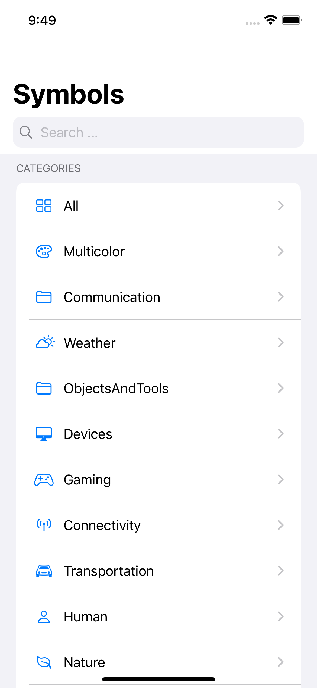
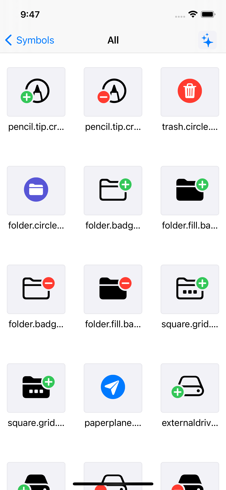
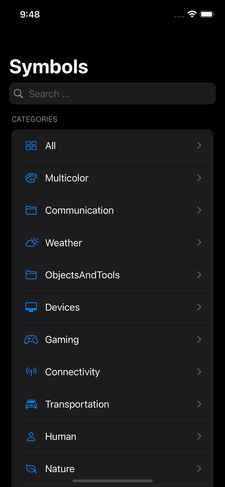
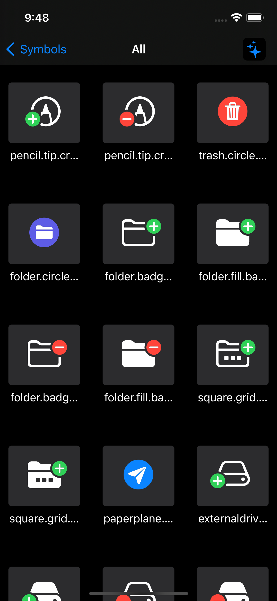

# SF Symbol iOS

a simple app just mock the SF Symbols of macOS version.

<table>
  <tr>
    <td>Home</td>
    <td>Detail</td>
  </tr>
  <tr>
    <td></td>
    <td></td>
  </tr>
  <tr>
    <td></td>
    <td></td>
  </tr>
</table>
